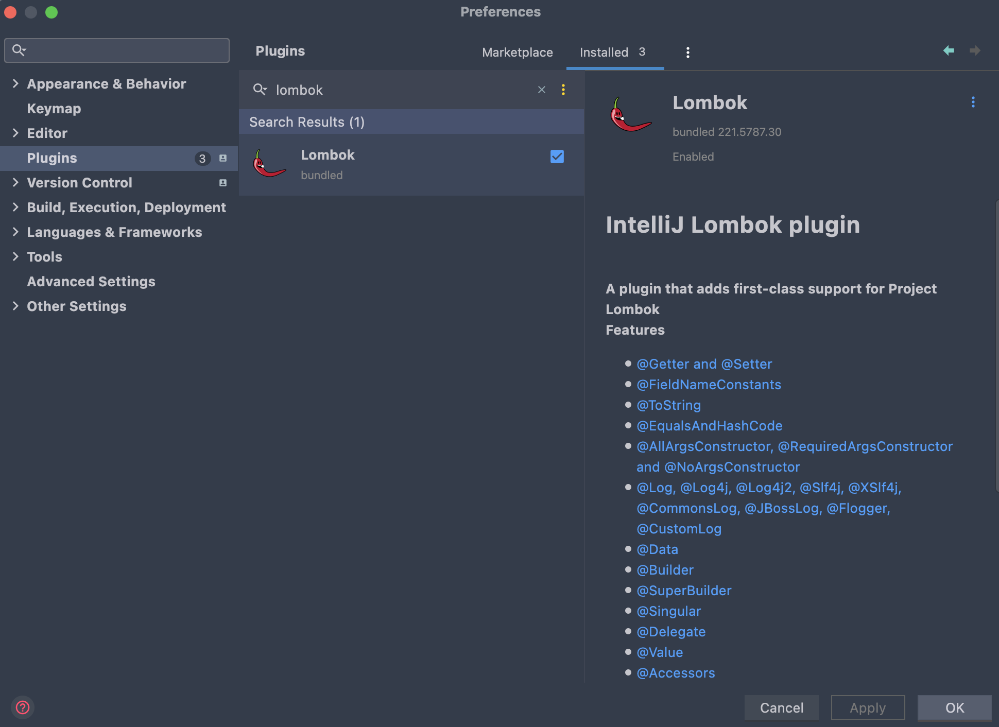
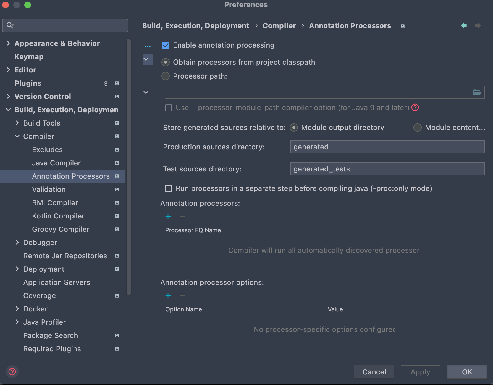

## 개발 환경

---

| 종류  | 환경                    |
|:---:|-----------------------|
| OS  | M1 Mac(Monterey 12.4) |
| IDE | Intellij(2022.1.2)    |

## Gradle Project 에 Lombok 적용하기

---

주로 라이브러리에 추가하는 통상적인 방법과 달리 Gralde Project는 라이브러리를 추가하지 않아도 plugin 으로 간단히 Lombok을 적용할 수 있습니다.
[lombok plugins guide](https://plugins.gradle.org/plugin/io.freefair.lombok) 에 접속하여 버전과 적용 방법을 확인할 수 있습니다.

### bulid.gradle 에 lombok plugin 추가

```yaml
    plugins {
        id "io.freefair.lombok" version "6.5.0.2"
    }
```

라이브러리 추가 뿐만 아니라 annotation 설정을 해야하는 일반 gradle 환경과 달리 간단하게 적용할 수 있는 것이 가장 큰 장점입니다.

## IntelliJ 에 Lombok 설정하기

---

### 플러그인 목록에 Lombok 추가

최신 Intellij 는 기본 플러그인에 Lombok 이 포함되어 있으며 플러그인 활성화가 되어있습니다. 따라서 정상적으로 활성화 되어있는지 확인만 하면 됩니다.

먼저 `Setting > Plugins` 를 차례로 클릭한 뒤 상단의 `Installed` 탭을 클릭합니다. 그 후 검색창에 **Lombok** 이 깔려있는지, 체크박스가 체크되어있는지 확인하면 됩니다.



### IntelliJ 설정 중 Annotaion Processing 을 활성화

마지막으로 Annotation Processing 이 활성화 되어있는지 확인합니다.

먼저 `Setting > Build, Execution, Deployment > Compiler > Annotation Processors` 를 차례로 클릭한 뒤 `Enable annotation processing` 이 체크 되어있는지 확인하면 됩니다.



## 적용 테스트

---

위 내용을 그대로 따랐을 경우 설정이 모두 끝났습니다. lombok annotation 을 사용하여 제대로 적용하였는지 확인합니다.
예제에서는 @Sl4j annotation 을 사용하여 제대로 설정하였는지 테스트 하도록 하겠습니다. 

```java
import lombok.extern.slf4j.Slf4j;

@Slf4j
public class LombokAnnotationTest {

    public static void main(String[] args) {
        log.info("lombok 의 {} annotation 을 사용하여 적용되었는지 테스트합니다. ", "@Sl4j");
    }
}
```

 
이상으로 Gradle Project 에 Lombok 을 간단히 적용하는 방법에 대해서 알아보았습니다. 감사합니다.

```toc
```